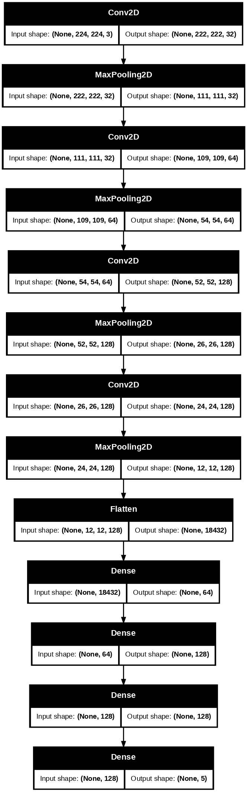
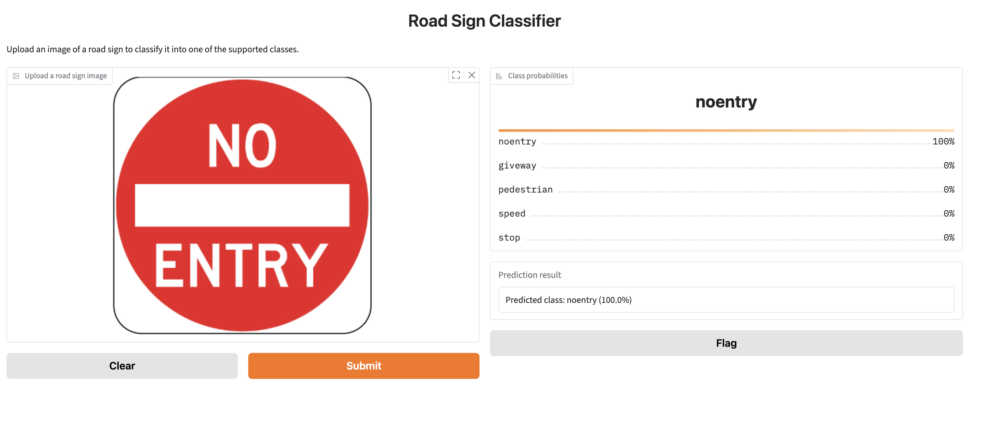

# 🚦 Australian Road Sign Classification using Deep Learning

<div align="center">


An end-to-end deep learning pipeline for recognising Australian road signs using TensorFlow and Keras.

_Model development • Training • Evaluation • Deployment_

</div>

---

## Project Overview

This project implements a complete image classification pipeline for recognising Australian road signs using Convolutional Neural Networks (CNNs).

The project demonstrates the complete machine learning workflow, including:

- Dataset preprocessing
- Data pipeline optimisation
- CNN model development
- Model training
- Performance evaluation
- Data augmentation
- Model comparison
- Interactive deployment using Gradio _(coming soon)_

The objective is to build an accurate and efficient classifier capable of recognising five Australian road sign categories.

---

## Demo

Try the Gradio web application at: 

https://huggingface.co/spaces/nlfernando/road-sign-classifier-aus

---

## Dataset

The dataset contains five Australian road sign classes.

| Class         | Description         |
| ------------- | ------------------- |
| 🚸 Give Way   | Give Way sign       |
| ⛔ No Entry   | No Entry sign       |
| 🚶 Pedestrian | Pedestrian crossing |
| 🚗 Speed      | Speed limit sign    |
| 🛑 Stop       | Stop sign           |

Images are resized to **224 × 224** pixels before training.

---

## Repository Structure

```text
Road-Sign-Classification/
│
├── app/
│   ├── app.py
│   ├── predictor.py
│   └── requirements.txt
│
├── notebooks/
│   └── Road_Sign_Classification_Solution.ipynb
│
├── models/
│   └── best_model.keras
│
├── images/
│
├── sample_images/
│
├── requirements.txt
├── LICENSE
└── README.md
```

---

## Technologies

| Category         | Technologies       |
| ---------------- | ------------------ |
| Language         | Python             |
| Framework        | TensorFlow, Keras  |
| Computer Vision  | OpenCV             |
| Data Analysis    | NumPy, Pandas      |
| Visualisation    | Matplotlib         |
| Machine Learning | Scikit-learn       |
| Deployment       | Gradio _(planned)_ |

---

## Model Architecture

The CNN architecture consists of:

- Input Layer (224 × 224 × 3)
- Four Convolutional Blocks
- ReLU Activations
- Max Pooling Layers
- Fully Connected Dense Layers
- Softmax Output Layer (5 Classes)

<p align="center">

</p>

---

## Data Pipeline

The training pipeline includes:

- Image resizing
- Pixel normalisation
- Efficient TensorFlow Dataset API
- Dataset caching
- Prefetching with AUTOTUNE
- Train / Validation split

---

## Data Augmentation

To improve generalisation, the following augmentation techniques are applied:

- Random Rotation
- Random Zoom

Image flipping was intentionally excluded because it changes the semantic meaning of traffic signs.

---

## Training Configuration

| Parameter     |                           Value |
| ------------- | ------------------------------: |
| Framework     |                TensorFlow/Keras |
| Input Size    |                       224 × 224 |
| Batch Size    |                              32 |
| Optimizer     |                            Adam |
| Loss Function | Sparse Categorical Crossentropy |
| Epochs        |                              30 |

---

## Results

The notebook evaluates multiple model configurations, including:

- Baseline CNN
- Augmented Dataset
- Optimised Input Pipeline
- Best Checkpoint Model

---

### Example Predictions

<p align="center">

</p>

---

## How to Run

Clone the repository.

```bash
git clone https://github.com/<username>/Road-Sign-Classification.git
```

Install dependencies.

```bash
pip install -r requirements.txt
```

Launch the notebook.

```bash
jupyter notebook notebooks/Road_Sign_Classification_Solution.ipynb
```

---

## Interactive Demo (Coming Soon)

A Gradio application will allow users to:

- Upload a road sign image
- Predict the sign category
- Display confidence scores
- Show Top-5 predictions

### Gradio App

Run locally

```bash
cd app
pip install -r requirements.txt
python app.py
```

The application loads the trained Keras model and predicts one of five Australian road sign classes.

---

## Future Improvements

- Transfer Learning (EfficientNet / MobileNet)
- Hyperparameter Optimisation
- Grad-CAM Visualisations
- TensorFlow Lite Export
- ONNX Conversion
- Docker Deployment
- Hugging Face Spaces Deployment

---

## License

This project is licensed under the MIT License.

---

## Acknowledgements

This project was developed for educational and portfolio purposes using TensorFlow, Keras, and the Python scientific computing ecosystem.
